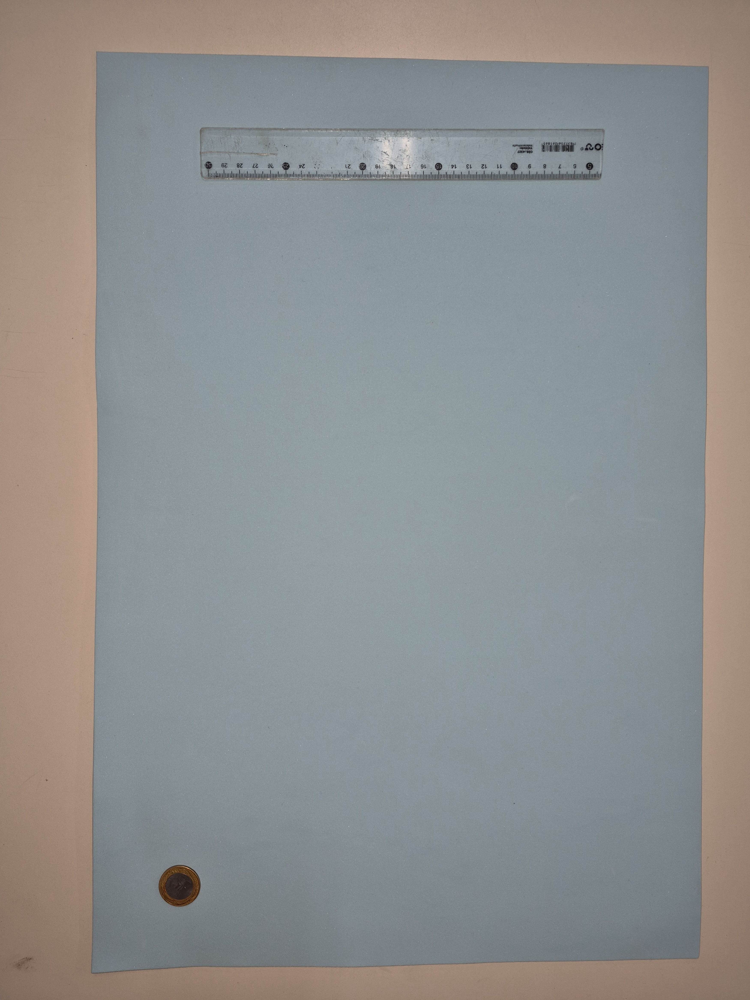
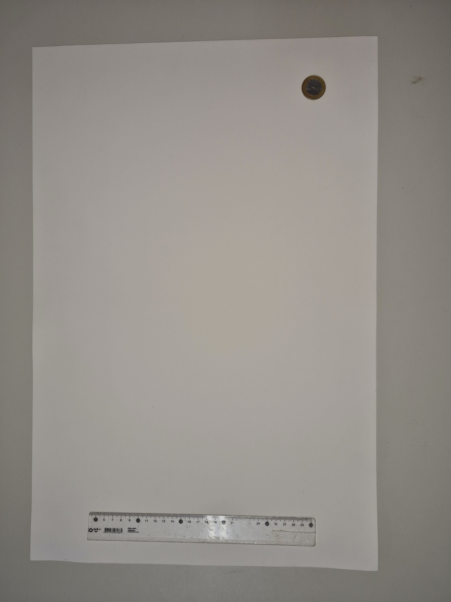
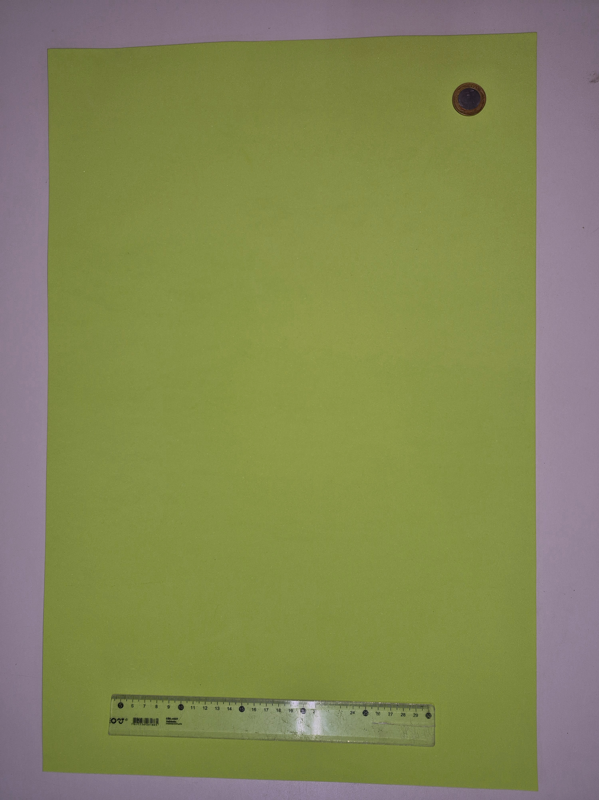
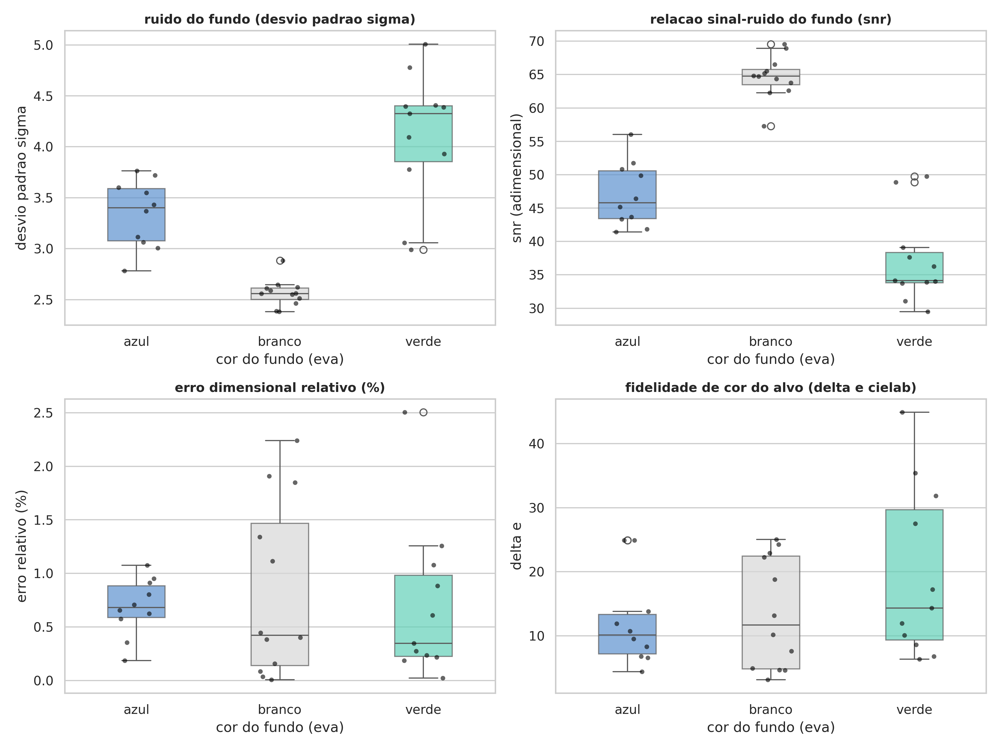
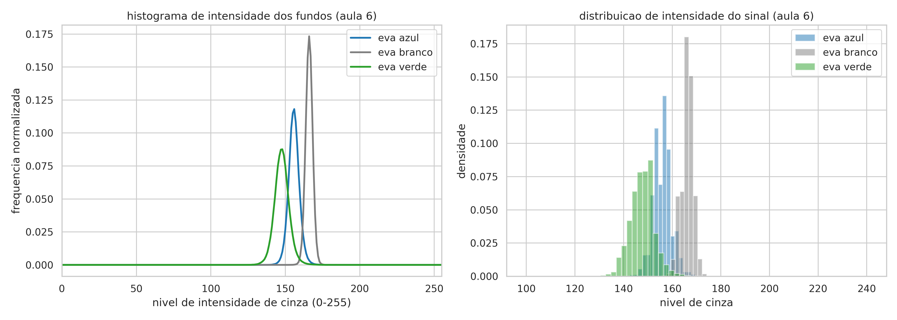
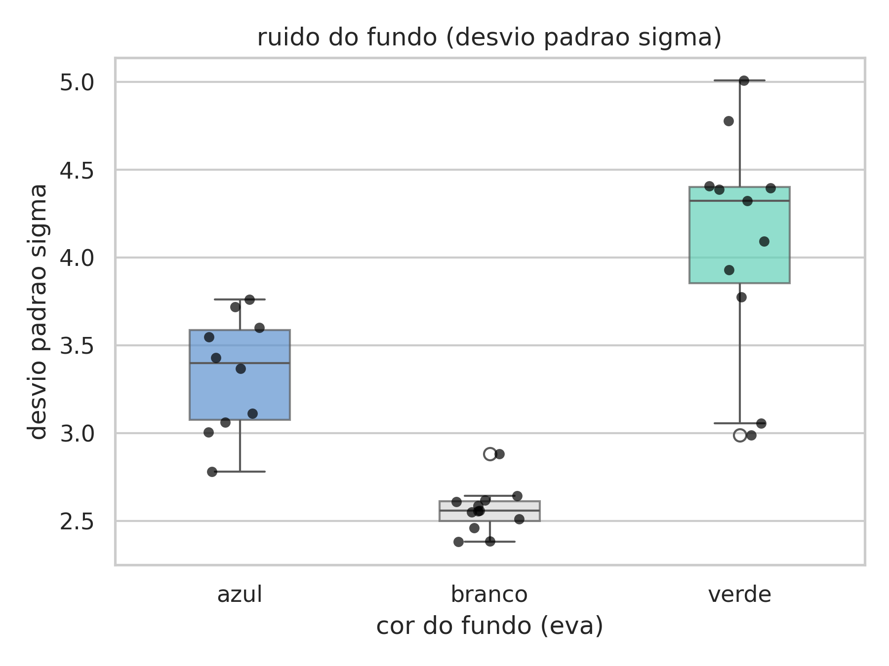
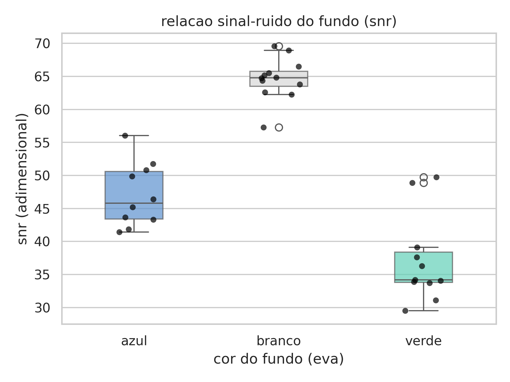
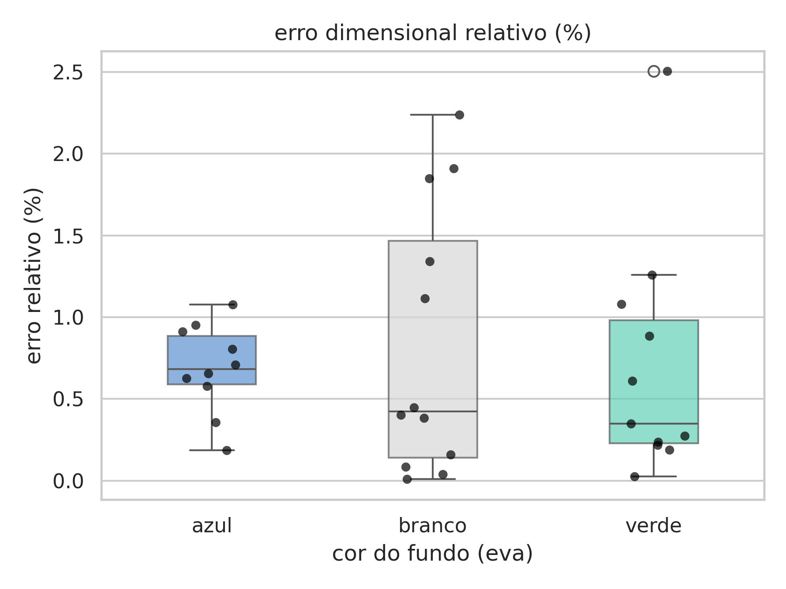
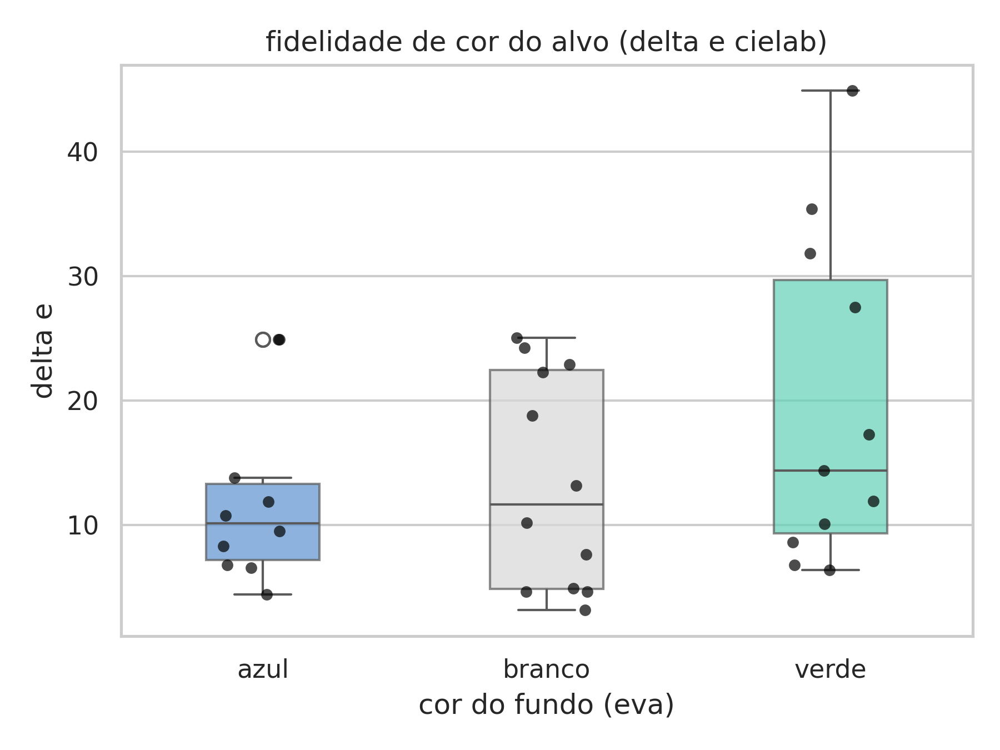

# Avaliação Experimental das Condições de Aquisição de Imagens em PDI

**Disciplina:** TAD0018 - Processamento Digital de Imagens (Turma 01 - 2026.2)  
**Instituição:** Escola Agrícola de Jundiaí (EAJ) — Universidade Federal do Rio Grande do Norte (UFRN)  
**Professor Responsável:** Prof. Dr. Antonino Feitosa  

---

## Equipe de Desenvolvimento

| Membro | Atribuição Principal | Foco Metodológico |
| :--- | :--- | :--- |
| **Natan** | Especialista em Aquisição e Protocolo Experimental | Montagem da bancada, controle de iluminação difusa e captura padronizada das fotografias. |
| **Thiago** | Desenvolvedor de Processamento Digital de Imagens | Implementação dos algoritmos de padronização espacial, escala geométrica e balanço cromático. |
| **Pedro Davi** | Analista de Métricas e Modelagem Estatística | Extração quantitativa de ruído, SNR, erro dimensional, fidelidade $\Delta E$ e testes de significância. |
| **Cleiton** | Redator Técnico e Integrador de Documentação | Redação do relatório científico em formato acadêmico, estruturação dos slides e consolidação. |

---

## Visão Geral do Projeto

O desempenho de sistemas modernos de Visão Computacional e Processamento Digital de Imagens depende intimamente da estabilidade e qualidade da etapa inicial de **aquisição no mundo real**. Variações na iluminação, textura da superfície de suporte e propriedades de reflexão difusa do plano de fundo influenciam diretamente o alcance dinâmico captado pelos sensores, o contraste das bordas e a confiabilidade de medições métricas.

Este projeto tem como objetivo **avaliar experimentalmente o impacto de três cores de fundo em folhas de EVA (azul claro, branco e verde claro)** nas métricas fundamentais de qualidade de imagem, utilizando **exclusivamente os conceitos e técnicas lecionados nas Aulas 01 a 06 (Unidade 1)** da disciplina.

### Fundamentação Teórica Baseada nas Aulas:
- **Aulas 01 e 02 (Fundamentos, Sensores e Aquisição):** Modelagem matricial $M \times N$, canais de cor (`cv2.split`/`cv2.merge`), conversão para tons de cinza (`cv2.cvtColor`), limiarização estática (`cv2.threshold`) e caracterização de ruído estocástico de sensor por desvio padrão ($\sigma$) e relação sinal-ruído ($\text{SNR} = \mu / \sigma$) em região homogênea.
- **Aulas 03 e 04 (Digitalização, Resolução e Interpolação):** Resolução espacial em pixels por centímetro (px/cm), redimensionamento matricial com interpolação linear (`cv2.resize` com `cv2.INTER_LINEAR`) e operações aritméticas com saturação (`np.clip`).
- **Aula 05 (Modelos de Cores e Calibração):** Espaços de cores RGB e CIELAB ($L^*a^*b^*$), algoritmo clássico *Gray World Color Constancy* (Slide 56) e cálculo de diferença de cor pelo padrão euclidiano CIE76 ($\Delta E$, Slide 59).
- **Aula 06 (Transformações de Intensidade e Contraste):** Análise comparativa da distribuição de níveis de cinza através de histogramas de intensidade (`cv2.calcHist`).

---

## Exemplos de Imagens Processadas

Abaixo apresentam-se amostras representativas das imagens após o pipeline de processamento de [`metodo_computacional.py`](metodo_computacional.py), que inclui correção de rotação para orientação vertical uniforme ($3000 \times 4000$), calibração métrica para 70 px/cm e equilíbrio cromático pelo modelo *Gray World* da Aula 05:

| Fundo Azul (EVA) | Fundo Branco (EVA) | Fundo Verde (EVA) |
| :---: | :---: | :---: |
|  |  |  |
| **Amostra:** `proc_20260908_085924.jpg`<br>Orientação vertical, 70 px/cm e Gray World | **Amostra:** `proc_20260908_090813.jpg`<br>Orientação vertical, 70 px/cm e Gray World | **Amostra:** `proc_20260908_090542.jpg`<br>Orientação vertical, 70 px/cm e Gray World |

---

## Gráficos e Análise Estatística

### 1. Painel Consolidado de Métricas (Aulas 01, 02, 04 e 05)
O painel integrado sintetiza a distribuição amostral e os testes de significância global para as quatro métricas investigadas:

<p align="center">
  
</p>

*Figura 1: Distribuições comparativas em boxplot com dispersão pontual de dados para Ruído ($\sigma$), Relação Sinal-Ruído ($\text{SNR}$), Erro Dimensional Relativo (%) e Fidelidade Cromática ($\Delta E$ CIELAB).*

---

### 2. Análise Espectral de Histogramas de Intensidade (Aula 06)
Aplicando o conceito de análise de contraste e histogramas da Aula 06 via `cv2.calcHist`:

<p align="center">
  
</p>

*Figura 2: Curvas de densidade e frequência normalizada dos níveis de cinza (0 a 255) nos fundos de EVA. Evidencia-se o pico estreito e uniforme do EVA branco nas altas luzes, contrastando com o alargamento das caudas e absorção espectral nos fundos verde e azul.*

---

### 3. Boxplots Individuais Detalhados

<details>
<summary><b>Clique aqui para expandir e visualizar os gráficos individuais de cada métrica</b></summary>
<br>

| Nível de Ruído do Sensor ($\sigma$ - Desvio Padrão) | Relação Sinal-Ruído ($\text{SNR} = \mu / \sigma$) |
| :---: | :---: |
|  |  |

| Erro Dimensional Relativo (%) | Fidelidade Cromática ($\Delta E$ CIELAB) |
| :---: | :---: |
|  |  |

</details>

---

## Estrutura do Repositório

```text
├── dataset_original/                  # Conjunto de 33 fotografias em alta resolução (4000x3000)
│   ├── AZUL/                          # 10 amostras com fundo em EVA azul claro
│   ├── BRANCA/                        # 12 amostras com fundo em EVA branco
│   └── VERDE/                         # 11 amostras com fundo em EVA verde claro
├── imagens_processadas/               # Fotografias padronizadas (orientação, escala e Gray World)
│   ├── azul/                          # Saídas processadas do dataset azul
│   ├── branco/                        # Saídas processadas do dataset branco
│   └── verde/                         # Saídas processadas do dataset verde
├── graficos_estatistica/              # Figuras e painéis gerados para a análise quantitativa
│   ├── boxplot_ruido_std.png          # Boxplot do ruído do fundo (desvio padrão sigma)
│   ├── boxplot_snr_fundo.png          # Boxplot da relação sinal-ruído (SNR)
│   ├── boxplot_erro_dimensional_relativo.png # Boxplot do erro percentual de escala
│   ├── boxplot_delta_e.png            # Boxplot da dispersão cromática no espaço CIELAB
│   ├── painel_consolidado_metricas.png# Painel integrado 2x2 com todas as métricas
│   └── histogramas_intensidade_fundos.png # Comparativo de histogramas de níveis de cinza (Aula 06)
├── metodo_computacional.py            # Script principal de padronização espacial e cromática (Thiago)
├── extrair_metricas.py                # Script de extração das métricas quantitativas de PDI (Pedro Davi)
├── analise_estatistica.py             # Script de análise estatística, testes ANOVA e gráficos (Pedro Davi)
├── metricas_experimento.csv           # Tabela consolidada com as 33 amostras do experimento
├── protocolo_experimental.md          # Protocolo detalhado do setup laboratorial e aquisição (Natan)
├── relatorio_final.md                 # Relatório científico integrado do projeto (Cleiton)
├── apresentacao_slides.md             # Roteiro formal para apresentação oral de 10 minutos (Cleiton)
├── acompanhamento_semanal_professor.md# Registro de progresso semanal e dúvidas para o professor
├── auditoria_projeto.md               # Auditoria técnica interna e rastreabilidade de requisitos
└── README.md                          # Documento de apresentação e guia de reprodução do projeto
```

---

## Guia de Reprodução Experimental

### 1. Pré-requisitos e Instalação
O projeto foi desenvolvido em ambiente Python 3 (versão 3.10 ou superior). As bibliotecas necessárias podem ser instaladas diretamente via terminal:

```bash
pip install opencv-python numpy scipy pandas matplotlib seaborn
```

### 2. Padronização Espacial e Cromática
Executa a correção de orientação vertical, a calibração de escala para 70 px/cm e o balanço cromático por *Gray World* para todas as imagens do dataset:

```bash
python metodo_computacional.py
```
*As imagens resultantes serão salvas em `imagens_processadas/{azul, branco, verde}/`.*

### 3. Extração das Métricas Quantitativas
Calcula os parâmetros de ruído ($\sigma$), relação sinal-ruído ($\text{SNR}$), diâmetro do alvo, erro dimensional relativo e dispersão cromática ($\Delta E$ CIELAB):

```bash
python extrair_metricas.py
```
*Gera o arquivo de dados consolidado `metricas_experimento.csv`.*

### 4. Análise Estatística e Visualizações
Gera os relatórios descritivos no terminal, realiza os testes de hipótese e produz todos os gráficos na pasta `graficos_estatistica/`:

```bash
python analise_estatistica.py
```

---

## Síntese dos Resultados Experimentais

A análise quantitativa sobre as 33 amostras coletadas sob iluminação controlada demonstrou com alta significância estatística que o **fundo em EVA branco** proporciona as melhores condições para aquisição digital:

| Métrica Avaliada | Fundo Azul (Média ± DP) | Fundo Branco (Média ± DP) | Fundo Verde (Média ± DP) | Valor-p (ANOVA) | Conclusão Experimental |
| :--- | :---: | :---: | :---: | :---: | :--- |
| **Nível de Ruído ($\sigma$)** | $3,340 \pm 0,333$ | **$2,563 \pm 0,132$** | $4,105 \pm 0,637$ | $4,49 \times 10^{-9}$ | Diferença altamente significativa; o branco possui menor dispersão. |
| **Sinal-Ruído ($\text{SNR}$)** | $47,03 \pm 4,87$ | **$64,63 \pm 3,19$** | $37,09 \pm 6,62$ | $2,71 \times 10^{-13}$ | O branco apresentou qualidade de sinal amplamente superior. |
| **Erro Dimensional ($E_{\text{rel}}$)**| **$0,685\% \pm 0,272\%$** | $0,831\% \pm 0,818\%$ | $0,693\% \pm 0,723\%$ | $0,8415$ | Sem diferença estatística; todos os fundos mantiveram erro $< 1\%$. |
| **Fidelidade de Cor ($\Delta E$)** | $12,17 \pm 7,25$ | $13,45 \pm 8,68$ | $19,54 \pm 13,23$ | $0,2095$ | Estabilidade mantida pela compensação cromática do Gray World. |

### Principais Conclusões:
1. **Qualidade do Sinal:** A reflexão difusa homogênea da folha branca minimiza variações espúrias captadas pelo sensor, proporcionando uma relação sinal-ruído $37,4\%$ superior à da folha azul e $74,2\%$ superior à da folha verde.
2. **Distribuição Espectral e Histograma:** Conforme observado nos histogramas da Aula 06, o fundo branco concentra suas intensidades em uma faixa compacta de altas luzes, enquanto os fundos verde e azul espalham a distribuição devido à absorção seletiva da energia luminosa do flash.
3. **Calibração Espacial Estável:** A abordagem de binarização simples e contagem de pixels da área circular viabilizou medição submétrica com erro médio inferior a $1\%$, validando a eficácia das técnicas elementares de PDI da Unidade 1.

---

## Licença e Considerações Acadêmicas
Projeto desenvolvido com finalidade estritamente didática e científica no âmbito do curso de Análise e Desenvolvimento de Sistemas da UFRN / EAJ. Todos os códigos e dados experimentais são abertos para fins de estudo e reprodução.